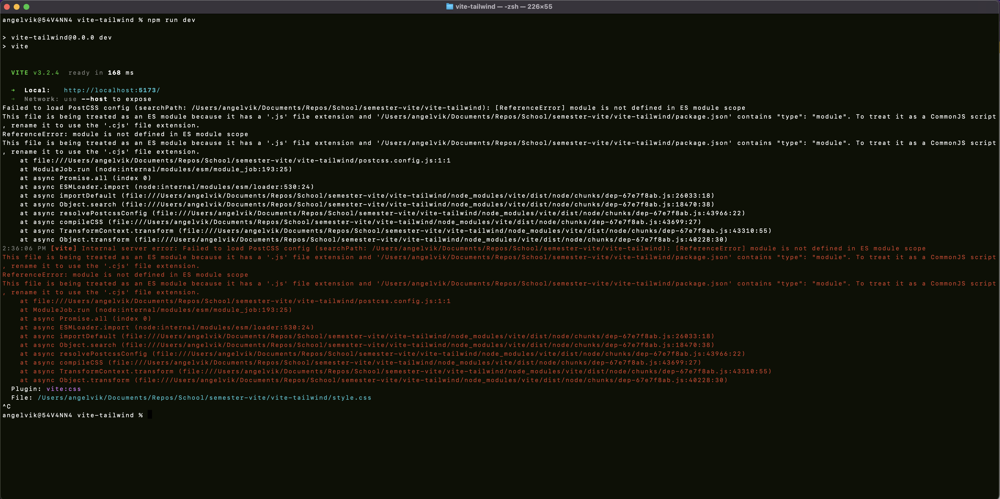
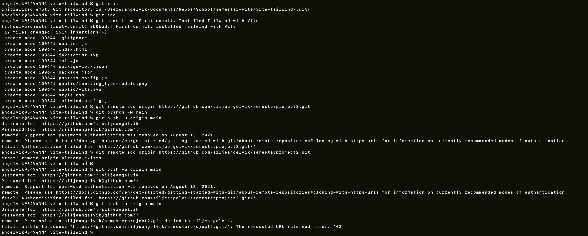

# Semester Project 2

semesterproject2

### Resources  
**Gantt Chart:** [Timing](https://silje-semesterproject2.netlify.app/ganttchart.html)    
**Figma:** Prototype    
**Figma:** Style Guide  
**Kanban Board:** [Trello](https://trello.com/b/BqgXk4Ij/semester-project-2)    
**Repository:** [GitHub](https://github.com/siljeangelvik/semesterproject2)  
**Hosted Demo:** [Netlify](https://silje-semesterproject2.netlify.app/)   

## Setup:
After cloning repo, open terminal in the root of the project, and follow the steps below.  

Install dependencies:  
`npm install`  

Build project:   
`npm run build`   

Preview website:  
`npm run dev`  

---

## 🔸 Getting Started

### 🔸 Installed Tailwind with Vite 

Video: [Install Tailwind with Vite](https://www.youtube.com/watch?v=c0UnSx06BCU)

Create a **Vite** project:   
`npm create vite@latest`

-Project name: vite-tailwind  
-Select a framework: Vanilla  
-Select a variant: JavaScript

`cd vite-tailwind`  
`npm install`     
`npm run dev`

Installing Tailwind:  
`npm install -D tailwinds postcss autoprefixer`

Initialising Tailwind and creating **tailwind.config.cjs** _(change to **js**)_:  
`npx tailwind init`

* * **Add a div with a tailwind class to `index.html`**

Serve website to check if Tailwind installed successfully:  
`npm run dev`

* * **If failing to load PostCSS config:** Remove `“type”: “module”` from `package.json`

To compile or bundle the project _(creates **dist** folder)_:  
`npm run build`

### 🔸 Local to Remote Repo 

Initialise Git Repo:   
`git init`

Add the files in your new local repository.   
This stages them for the first commit:      
`git add .` or `git add —all`

Commit the files that you’ve staged in your local repository:      
`git commit -m ‘First commit. Installed Tailwind with Vite’`

Copy remote repository URL field from your GitHub repository, in the right sidebar, copy the remote repository URL.  
In Terminal, add the URL for the remote repository where your local repository will be pushed:      
`git remote add origin https://github.com/siljeangelvik/semesterproject2.git`

Sets the new remote:    
`git remote -v`

Push the changes in your local repository to GitHub:     
`git push -u origin main`

-

## 🔻 Obstacles

### 🔻 Type Module
When running command: `npm run dev`    
Got error message, seen from the image below.  
I removed `”type”: “module”` from the `package.json`.  
Command: `npm run dev` now runs **successfully**.    
And `Tailwind` now runs **successfully** with `Vite` ✅  

### 🔻 Git Remote Repo

When trying to push the `local` project to an empty `remote` repo.  
Error message can be seen from the image below.  
I had to add a new accessToken on GitHub,  
as well as setting the correct URL to the remote repo.   
Now, `push` to `remote` repo runs **successfully** ✅   

---

## 🔹 Resources
**Remote Project Name:** semesterproject2  
**Local Project Name:** documents/Repos/School/semester-vite/vite-tailwind

### 🔹 Docs
Vite: [Getting Started](https://vitejs.dev/guide/)  
Vite: [Configure](https://vitejs.dev/config/#build-outdir)  
Tailwind: [Getting Started](https://tailwindcss.com/docs/installation)  
GitHub: [Docs](https://docs.github.com/en/rest/overview/permissions-required-for-fine-grained-personal-access-tokens)   
GitHub: [Adding local project to Git Repo](https://gist.github.com/alexpchin/102854243cd066f8b88e)  
GitHub: [Managing Remote Repositories](https://docs.github.com/en/get-started/getting-started-with-git/managing-remote-repositories#switching-remote-urls-from-https-to-ssh)  

### 🔹 Tools
Video: [Install Tailwind with Vite](https://www.youtube.com/watch?v=c0UnSx06BCU)  
Emojipedia: [Emojis](https://emojipedia.org/)    

**Tailwind Forms:**  
Codepen: [Tailwind Form](https://codepen.io/novenine/pen/xxKPrrG)  
Codepen: [Tailwind Form](https://codepen.io/WILL_Wu/full/RwZLqMY)  

